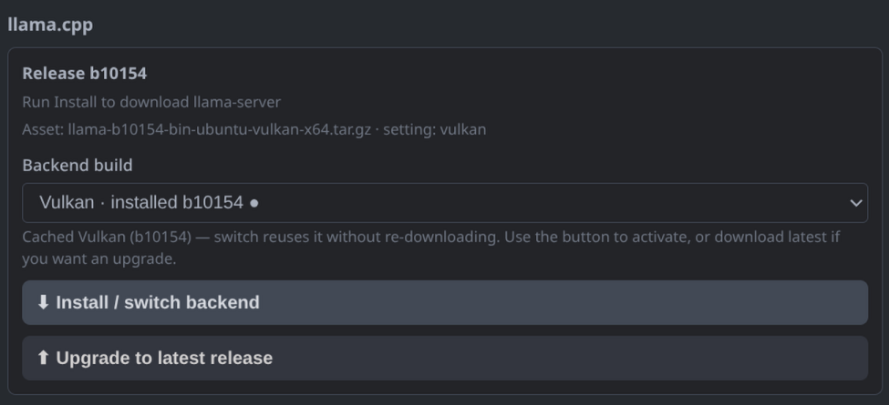
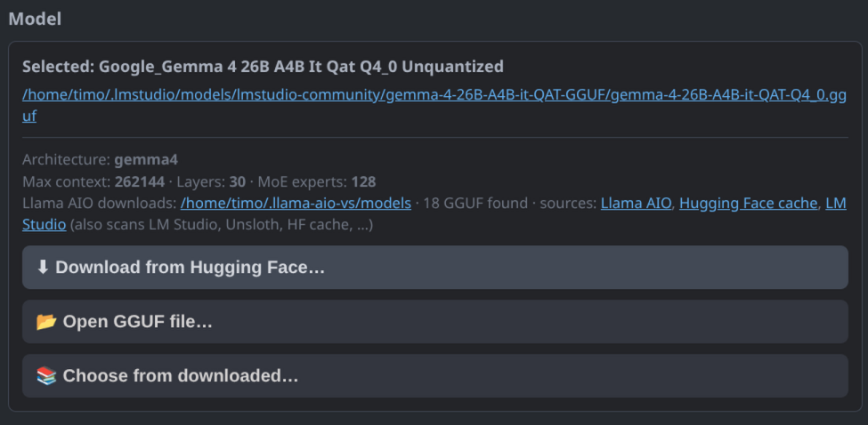
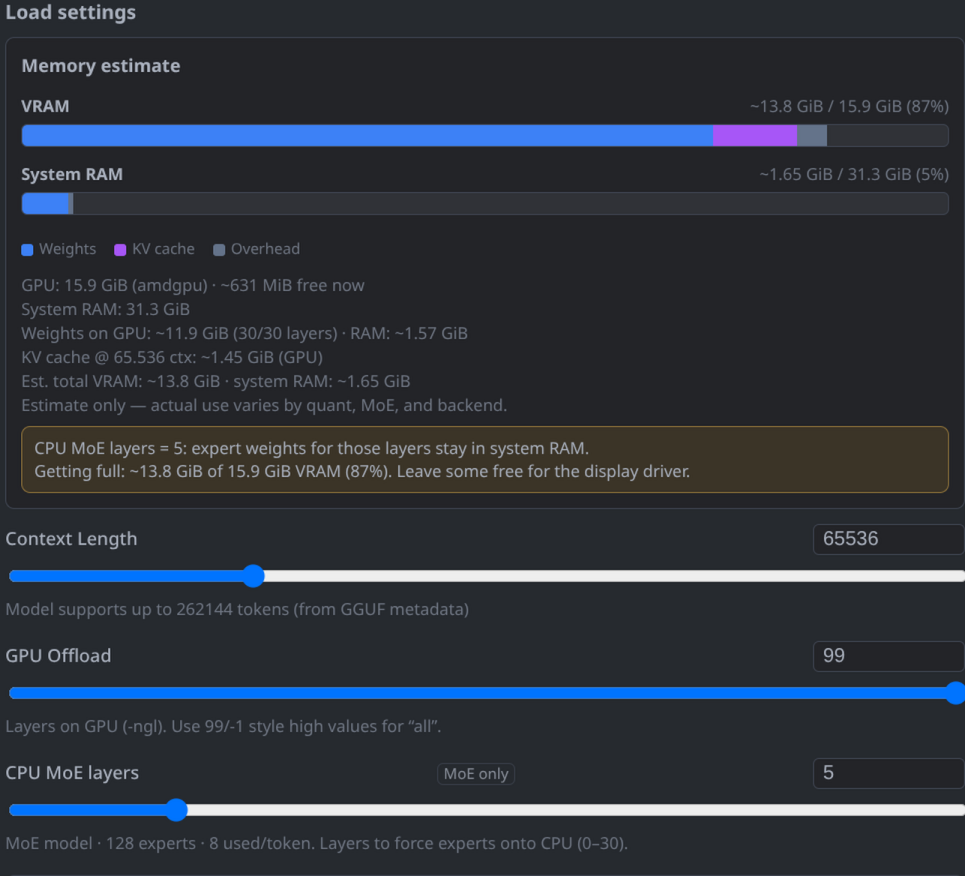
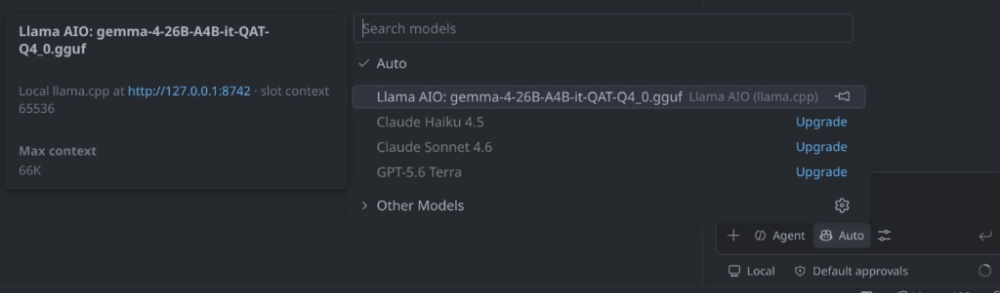
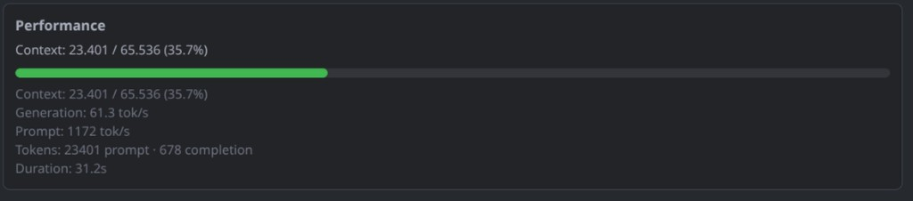
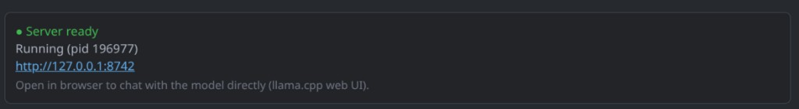

# Llama AIO (VS Code)

Local **llama.cpp** for VS Code: install binaries, manage GGUF models, tune load settings with memory estimates, run one shared `llama-server`, and use it in **GitHub Copilot Chat**.

## Requirements

- VS Code **1.109+** (language model chat providers)
- Network access for llama.cpp releases and Hugging Face downloads
- **Windows:** PowerShell (zip extract / external terminal). CUDA installs also fetch the matching `cudart` DLL package.

## Quick start

```bash
cd llama-aio-vs
make          # compile + build .vsix
# or: make install
```

Install `llama-aio-vs-*.vsix` via **Extensions: Install from VSIX…** (or `make install`), then reload the window.

1. Open the **Llama AIO** activity bar panel
2. Install / switch a backend
3. Download, open, or pick a GGUF
4. Start or reload the server
5. In Copilot Chat, select **Llama AIO: …** in the model picker

## llama.cpp backends

Download the newest llama.cpp version directly from within VS Code.



- **Vulkan** — default GPU path (Linux / Windows; good for AMD)
- **CUDA** — when an NVIDIA GPU is detected
- **CPU** — no GPU (`-ngl` ignored)

Installs live under `~/.llama-aio-vs/llama.cpp/<backend>/`. Switching reuses a cached build; **Upgrade to latest release** re-downloads. Extra families (`rocm`, `openvino`, `sycl`, `auto`) via `llamaAio.backend`.

## Models

Download models directly from Hugging Face or pick a model that was downloaded by other tools.



## Load settings & memory estimates



Primary controls: memory estimate (VRAM / RAM), context length, GPU offload, and CPU MoE layers. Selecting a model auto-recommends settings aimed at ~2 GiB free VRAM. Threads, batch, KV/mmap/RoPE, and speculative decoding are under **Advanced Settings**.

## GitHub Copilot Chat

Use local LLMs directly in GitHub Copilot Chat.



## Performance

Automated context monitoring and performance measurement of the current Chat session.



Also shown in the status bar (tok/s, context %). Toasts at ~80% / ~90% fill. Context % is `prompt_tokens / slot n_ctx` for the last request.

## Shared server

The llama.cpp server is started from within VS Code and is shared between all running VS Code instances.



- Endpoint: `http://127.0.0.1:8742` (override with `llamaAio.host` / `llamaAio.port`)
- Lock / log: `~/.llama-aio-vs/runtime/server.lock.json`, `llama-server.log`
- Default launch: **external terminal** (`llamaAio.launchMode`); close the window to stop, or use `background`

## Key load settings → llama.cpp flags

| UI | Flag |
|---|---|
| Context Length | `--ctx-size` |
| GPU Offload | `-ngl` |
| CPU Threads | `-t` |
| Eval / Physical batch | `-b` / `-ub` |
| Max concurrent predictions | `-np` |
| CPU MoE layers | `--n-cpu-moe` |
| Offload KV to GPU | default / `--no-kv-offload` |
| Keep model in memory / Try mmap | `--load-mode mlock` / `mmap` / `none` |
| RoPE base/scale | `--rope-freq-base` / `--rope-freq-scale` |
| Seed | `--seed` |
| Context checkpoints | `--cache-reuse` |
| Speculative MTP | `--spec-type draft-mtp` (+ draft n-max/min, p-min) |

## Commands

- `Llama AIO: Open Settings`
- `Llama AIO: Install / Upgrade llama.cpp`
- `Llama AIO: Download Model from Hugging Face`
- `Llama AIO: Open GGUF File…`
- `Llama AIO: Choose from Downloaded Models`
- `Llama AIO: Start Server` / `Stop Server` / `Reload Server (Apply Settings)`
- `Llama AIO: Show Status`

## Settings

- `llamaAio.port` / `llamaAio.host` (defaults `8742` / `127.0.0.1`)
- `llamaAio.installDir` / `llamaAio.modelsDir` / `llamaAio.extraModelDirs`
- `llamaAio.hfToken` — gated / private HF models
- `llamaAio.autoStart`
- `llamaAio.backend` — `auto` / `vulkan` / `cuda` / `cpu` / `rocm` / `openvino` / `sycl`
- `llamaAio.launchMode` — `externalTerminal` (default) or `background`

## Notes

- **Keep Model in Memory** uses `--load-mode mlock` (mmap on Windows); it does not control process lifetime.
- MTP needs a GGUF with next-n / MTP layers. Copilot **Agent** prompts are large — prefer a GPU backend or Ask mode on CPU.

## License

This project is licensed under the [MIT License](LICENSE).

Copyright (c) 2026 Timo Leser
