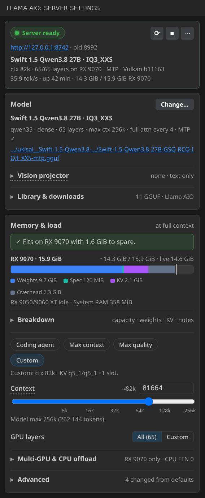
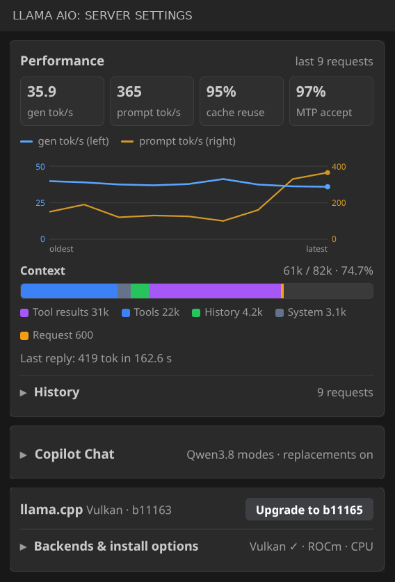
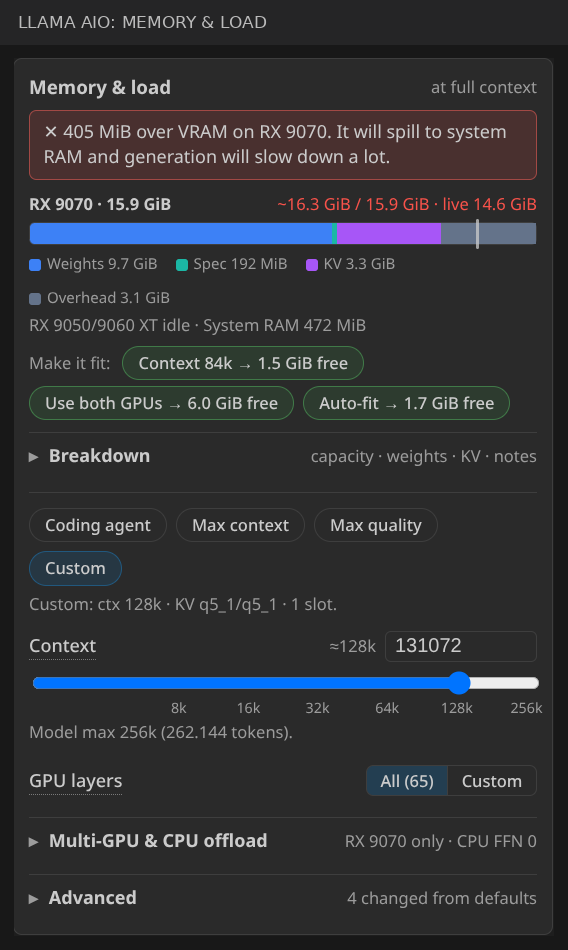
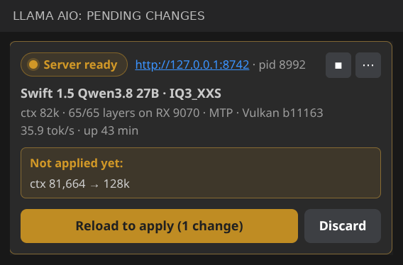

# Llama AIO for VS Code

Run local LLMs with **llama.cpp** and use them in **GitHub Copilot Chat** — without leaving VS Code.

Llama AIO installs llama.cpp for you, finds or downloads GGUF models, tells you whether a model fits on your GPU before you load it, and runs one `llama-server` that all your VS Code windows share.

  
  

## Get started

1. Open the **Llama AIO** view in the activity bar.
2. Install llama.cpp (Vulkan, CUDA or CPU — picked for your hardware).
3. Choose a model: **Change…** lists GGUF files already on disk (Llama AIO, LM Studio, Unsloth, Hugging Face cache) or searches Hugging Face. First time? Use the one-click starter model.
4. Press **Start**, then pick **Llama AIO: …** in the Copilot Chat model picker.

## Know if it fits — before you load it

The **Memory & load** card estimates VRAM and RAM at full context and gives one clear answer: fits, tight, or will spill to system RAM. When it doesn't fit, it offers one-click fixes such as a shorter context, using an idle second GPU, or a smaller KV cache — each checked against the estimate before it's shown.

  

- **Presets:** Coding agent, Max context (largest context that fits), Max quality.
- **Main controls:** context length, GPU layers, multi-GPU split, CPU offload for MoE/FFN layers.
- **Advanced:** threads, batch sizes, KV cache types, flash attention, reasoning, RoPE and speculative decoding (MTP, DFlash, n-gram). Filter by name or flag, or show only what you changed.

## See what's running

The header always shows the loaded model, context, GPU layers, speed and memory. Change a setting while the server runs and it lists exactly what will change — apply with **Reload**, or **Discard** to go back.

  

The **Performance** card shows generation and prompt speed, cache reuse, speculative acceptance, and what fills your context (tools, tool results, history…).

## Copilot Chat

The running model appears in Copilot Chat as **Llama AIO: …**, including Agent mode with streamed replies and tool calls. Curated sampling modes are applied automatically for well-known model families; otherwise set temperature, top-p/k and max tokens under **Copilot Chat → Request defaults**.

## Good to know

- **One shared server** at `http://127.0.0.1:8742` for all VS Code windows. It starts in an external terminal (logs visible) or in the background.
- **Backends:** Vulkan (default, good for AMD), CUDA (NVIDIA), CPU, or a `llama-server` already on your `PATH`. Upgrades are swapped in only after a successful download; pin a release tag or install from an archive if you need to.
- **Licences:** the Hugging Face picker shows each model's licence and warns before downloading anything that isn't clearly permissive.
- **Vision:** attach an `mmproj` projector to send images (added automatically when one sits next to the model).
- **Files:** everything lives under `~/.llama-aio-vs/` — binaries, models, `config.json`, and the server log.

## Settings

Run **Llama AIO: Open Configuration File** to edit `~/.llama-aio-vs/config.json`. Useful keys in the `app` section:

| Key | What it does |
| --- | --- |
| `port` / `host` | Server address (default `8742` / `127.0.0.1`) |
| `modelsDir` / `extraModelDirs` | Where models are downloaded / extra folders to scan |
| `hfToken` | Token for gated or private Hugging Face models |
| `backend` | `auto`, `vulkan`, `cuda`, `cpu`, `rocm`, … |
| `launchMode` | `externalTerminal` (default) or `background` |
| `autoStart` | Start the server when VS Code opens |

All commands are in the Command Palette under **Llama AIO:** — start/stop/reload, open log, copy the server command line, install llama.cpp, download models, and view the last Copilot request or response.

## Requirements

- VS Code 1.109 or newer
- GitHub Copilot Chat for the chat integration
- Linux, Windows or macOS; a GPU is optional

## License

[MIT](LICENSE) © 2026 Timo Leser
