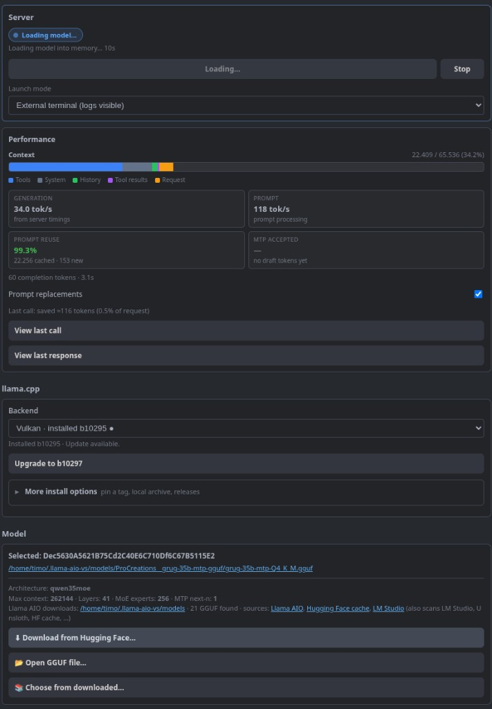

# Llama AIO (VS Code)

Local **llama.cpp** for VS Code: install newest llama.cpp binaries, manage GGUF models, tune load settings with memory estimates, run one shared `llama-server`, and use it in **GitHub Copilot Chat**.

<p align="center">
  
  
</p>

## Quick start

```bash
cd llama-aio-vs
make          # test + compile + build .vsix
# or: make install
```

Install `llama-aio-vs-*.vsix` via **Extensions: Install from VSIX…** (or `make install`), then reload the window.

1. Open the **Llama AIO** activity bar panel
2. Install / switch a backend
3. Download, open, or pick a GGUF
4. Start or reload the server
5. In Copilot Chat, select **Llama AIO: …** in the model picker

## llama.cpp backends

Download the newest llama.cpp version directly from within VS Code.

- **Vulkan** — default GPU path (Linux / Windows; good for AMD)
- **CUDA** — when an NVIDIA GPU is detected
- **CPU** — no GPU (`-ngl` ignored)

Installs live under `~/.llama-aio-vs/llama.cpp/<backend>/`. Switching reuses a cached build; **Upgrade to latest release** resolves the newest tag and downloads the matching archive. New binaries are staged and swapped in at the end, so a failed install leaves the working one in place.

To pin a build or work offline: **Install release tag…** or **Install from archive…**. Browse builds at [llama.cpp releases](https://github.com/ggml-org/llama.cpp/releases). Extra families (`rocm`, `openvino`, `sycl`, `auto`) via `llamaAio.backend`.

## Models

Download models directly from Hugging Face or pick a model that was downloaded by other tools.

The picker shows each model's licence next to its name and warns before downloading anything that is not clearly permissive — for example Llama and Gemma models, which allow commercial use only under extra conditions. Split GGUFs (`…-00001-of-0000N.gguf`) are sized as one model.

## Load settings & memory estimates

The estimate shows VRAM / RAM usage at **full context**, so you can tell whether a configuration fits before starting the server. Selecting a model auto-recommends settings that leave ~2 GiB of VRAM free.

Three presets cover the common cases:

- **Coding agent** — near-lossless quality with room for tools and history
- **Max context** — the largest context that still fits your VRAM
- **Max quality** — spends VRAM on key precision instead of context

Main controls are context length, GPU offload, and CPU MoE layers. Threads, batch sizes, KV cache types, flash attention, reasoning, RoPE, and speculative decoding live under **Advanced Settings**, each group with its own reset button.

## GitHub Copilot Chat

Use local LLMs directly in GitHub Copilot Chat — the running model appears as **Llama AIO: …** in the model picker.

Sampling defaults (temperature, top-p, top-k, max tokens) are set under **Request defaults**. Well-known models such as Qwen3 ship with curated modes that override those values; the panel says so when a mode is active.

### Prompt replacements

Copilot's system prompt is long. Optional find/replace rules shrink it before the request is sent, and the panel reports how many tokens were saved. Toggle and custom rule file: `llamaAio.promptReplacementsEnabled` / `llamaAio.promptReplacementsFile`.

## Performance

Automated context monitoring and performance measurement of the current Chat session.

Tokens/s, context fill, and prompt reuse (how much of the prompt came from the KV cache) for the last request, also shown in the status bar. Toasts at ~80% / ~90% context fill.

## Shared server

The llama.cpp server is started from within VS Code and is shared between all running VS Code instances.

- Endpoint: `http://127.0.0.1:8742` (override with `llamaAio.host` / `llamaAio.port`)
- Lock / log: `~/.llama-aio-vs/runtime/server.lock.json`, `llama-server.log`
- Default launch: **external terminal** (sidebar **Launch** control, or `llamaAio.launchMode`); close the window to stop, or choose **Background**

Only llama-servers are ever adopted or stopped — anything else holding the port is left alone and reported instead.

## Key load settings → llama.cpp flags

| UI                              | Flag                                                 |
| ------------------------------- | ---------------------------------------------------- |
| Context Length                  | `--ctx-size`                                       |
| GPU Offload                     | `-ngl`                                             |
| CPU Threads                     | `-t`                                               |
| Eval / Physical batch           | `-b` / `-ub`                                     |
| Max concurrent predictions      | `-np`                                              |
| CPU MoE layers                  | `--n-cpu-moe`                                      |
| KV cache type K / V             | `--cache-type-k` / `--cache-type-v`              |
| Flash attention                 | `--flash-attn`                                     |
| Unified KV cache                | `--kv-unified` / `--no-kv-unified`               |
| Offload KV to GPU               | default /`--no-kv-offload`                         |
| Cache reuse (KV shift)          | `--cache-reuse`                                    |
| Context checkpoints             | `--ctx-checkpoints`                                |
| Reasoning format / budget       | `--reasoning-format` / `--reasoning-budget`      |
| Keep model in memory / Try mmap | `--load-mode mlock` / `mmap` / `none`          |
| RoPE base/scale                 | `--rope-freq-base` / `--rope-freq-scale`         |
| Seed                            | `--seed`                                           |
| Speculative MTP                 | `--spec-type draft-mtp` (+ draft n-max/min, p-min) |

## Commands

- `Llama AIO: Open Settings`
- `Llama AIO: Install / Upgrade llama.cpp`
- `Llama AIO: Install llama.cpp by Release Tag…`
- `Llama AIO: Install llama.cpp from Archive…`
- `Llama AIO: Download Model from Hugging Face`
- `Llama AIO: Open GGUF File…`
- `Llama AIO: Choose from Downloaded Models`
- `Llama AIO: Start Server` / `Stop Server` / `Reload Server (Apply Settings)`
- `Llama AIO: Show Status`
- `Llama AIO: View Last Call` / `View Last Response`

## Settings

- `llamaAio.port` / `llamaAio.host` (defaults `8742` / `127.0.0.1`)
- `llamaAio.installDir` / `llamaAio.modelsDir` / `llamaAio.extraModelDirs`
- `llamaAio.hfToken` — gated / private HF models
- `llamaAio.autoStart`
- `llamaAio.backend` — `auto` / `vulkan` / `cuda` / `cpu` / `rocm` / `openvino` / `sycl`
- `llamaAio.launchMode` — `externalTerminal` (default) or `background`
- `llamaAio.promptReplacementsEnabled` / `llamaAio.promptReplacementsFile`

## Notes

- **Keep Model in Memory** uses `--load-mode mlock` (mmap on Windows); it does not control process lifetime.
- Quantized V cache requires flash attention; the settings panel warns when the combination cannot work.
- MTP needs a GGUF with next-n / MTP layers. Copilot **Agent** prompts are large — prefer a GPU backend or Ask mode on CPU.
- **NixOS:** official llama.cpp Linux archives are Ubuntu builds that need the FHS dynamic linker (`/lib64/ld-linux-x86-64.so.2`). Stock NixOS does not provide it, so a freshly downloaded binary often fails with a misleading “No such file or directory”. Llama AIO detects this and will:
  1. wrap the binary with `steam-run` when that command is on `PATH`, or
  2. fall back to a nixpkgs `llama-server` already on `PATH`, or
  3. show how to enable `programs.nix-ld.enable = true` (and restart VS Code).
  Vulkan may also need nixGL / correct ICD packages.

## Development

```bash
npm test        # unit tests (Node's built-in runner, no extra deps)
npm run compile # type-check + build to out/
```

Tests live in `src/test/` and build to `out-test/`, so nothing test-related ships in the VSIX. `make package` runs them before packaging.

## License

This project is licensed under the [MIT License](LICENSE).

Copyright (c) 2026 Timo Leser
